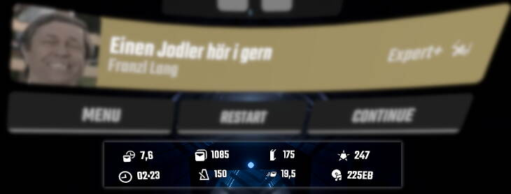

## PauseSongInfo

Adds details of the played song to the pause screen :D Commissioned by [Sync](https://www.twitch.tv/sync_bs)

You can also scale down the overall size of the Pause menu by editing the "MenuScale" in the mods config file.

---

The Game version(s) specific releases are compatible with are mentioned in the Release title (Its obviously possible latest is not supported assuming its been released recently). If you need the plugin for an older version - Grab an older release that fits 🤯

## Install

#### You can always find the latest download in [The Releases](releases), simply drag the Plugin DLL into the Plugins folder

## Added details

- Notes per second
- Note Count
- Obstacle Count
- Bomb Count
- Song Length
- Song BPM
- Note Jumpspeed
- Map BSR code, if available (Requires SongDetails, optional)
